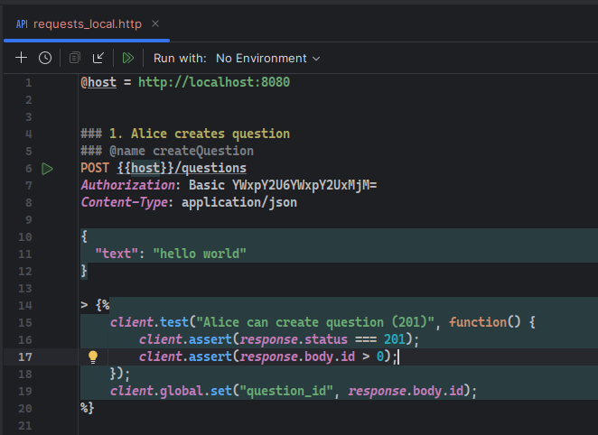
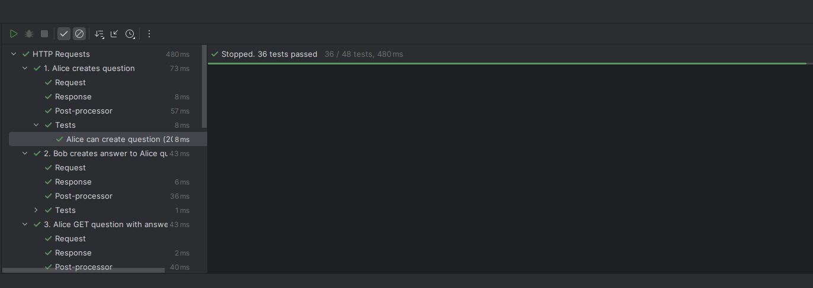

# test-question — краткое описание

## 🚀 Запуск
```bash
docker compose up --build
```

## 🔧 Локальный запуск
```bash
make deps       # установить goose, mockery, golangci-lint
make run        # go run ./cmd/api
```

## 🧪 Тесты
```bash
make test             # юнит
make test-integration #интеграционные
make test-e2e         #e2e
make ci               # линтер + все тесты
```

## 📡 HTTP-тесты (JetBrains)
Открыть файл: requests_local.http\
Нажать ▶ Run рядом с запросом.\
JetBrains поддерживает {{variables}}.



### Конфигурация приложения

Для удобства разработки и стабильного развёртывания используется многоуровневая схема конфигурации с приоритетами:

1. **OS ENV** — переменные окружения операционной системы  
   Самый высокий приоритет. Используются в проде, CI/CD, контейнерах.

2. **.env.local** — локальные настройки разработчика  
   Не коммитится. Позволяет переопределить значения из `.env` без влияния на других.

3. **.env** — базовый конфиг проекта  
   Дефолтные значения для локального запуска, docker-compose, e2e-тестов.

**Приоритет:** `OS ENV` → `.env.local` → `.env`

В продакшене используются только переменные окружения (OS ENV); `.env` и `.env.local` предназначены для разработки.

### Формат логирования

Приложение поддерживает два формата логов:

- **Текстовый (human-friendly)** — используется локально.  
  Удобно читать при разработке: цветные логи, краткие сообщения.

- **JSON** — используется в продакшене.  
  Машиночитаемый формат, совместимый с ELK, Loki, ClickHouse-логированием, Kubernetes-агентами и любым лог-агрегатором.

Выбор формата определяется конфигурацией окружения — локально автоматически включается человекочитаемый вывод, в проде всегда применяется структурированный JSON-лог для корректной индексации.

### Уровни логирования (`LOG_LEVEL`)

Приложение использует стандартные уровни `slog`:

- **debug** — максимально подробные технические сообщения  
  (SQL-запросы, входные данные, внутренние решения use-case’ов).  
  Используется только локально.

- **info** — стандартный уровень по умолчанию.  
  Отражает основные события приложения: успешные запросы, старт сервера, миграции.

- **warn** — нестандартные, но допустимые ситуации: некорректные данные от клиента, ретраи, медленные запросы.

- **error** — ошибки, после которых запрос не может быть корректно обработан.  
  Все `http 5xx` попадают сюда.

Уровень задаётся переменной окружения: `LOG_LEVEL`

---

### Уровни логирования GORM (`LOG_LEVEL_GORM`)

GORM использует собственные уровни логирования SQL-активности.
Переменная окружения **`LOG_LEVEL_GORM`** управляет тем, какие SQL-события выводятся:

* **silent** — полное отключение логов GORM
  (рекомендуется для продакшена с внешним логированием SQL).

* **error** — логируются только SQL-ошибки
  (например: ошибки подключения, нарушенные ограничения, проблемы транзакций).
  Уровень по умолчанию.

* **warn** — предупреждения
  (медленные запросы, неправильные индексы, неэффективные SQL-паттерны).

* **info** — все запросы
  (каждый SQL c параметрами, временем выполнения; подходит только для локальной разработки).

Пример настройки:

```env
LOG_LEVEL_GORM=warn
```

#### Что именно логирует GORM

* **info**:
  `SELECT`, `INSERT`, `UPDATE`, `DELETE`, параметры, время выполнения.

* **warn**:
  медленные запросы (`>200ms`), подозрительные шаблоны запросов.

* **error**:
  ошибки SQL, ошибки транзакций, ошибки драйвера.

* **silent**:
  GORM никак не засоряет вывод.


# 🟪 **Проект: Questions & Answers API (архитектурное описание)**

Проект представляет собой минималистичное, но профессионально структурированное REST API-приложение для работы с сущностями:

* **Questions** — вопросы, создаваемые пользователями.
* **Answers** — ответы к вопросам.
* **Users** — авторизация через Basic Auth, сущности пользователей хранятся в PostgreSQL.

API покрывает полный CRUD-функционал:

### Questions

* `POST /questions` — создать вопрос
* `GET /questions` — список вопросов
* `GET /questions/{id}` — получить вопрос + ответы
* `DELETE /questions/{id}` — удалить вопрос (+каскадное удаление ответов)

### Answers

* `POST /questions/{id}/answers` — создать ответ
* `GET /answers/{id}` — получить ответ
* `DELETE /answers/{id}` — удалить ответ

Присутствует **полный набор юнит-тестов**, **интеграционных тестов** (repository-tests, infrasuite) и **E2E-тестов** (testcontainers + реальный PostgreSQL + HTTP-router + Basic Auth).

---

# 🟦 **Архитектура проекта**

Проект следует классической многослойной DDD-подобной структуре с чёткой изоляцией ответственности:

```
cmd/
internal/
  entity/
  repository/
  usecase/
  rpc/
  infra/
  pkg/
  tests/
migration/
```

## 📌 1. `cmd/` — входная точка приложения

Содержит:

* `cmd/api/main.go` — загрузка окружения, инициализация инфраструктуры
* `cmd/router.go` — регистрация HTTP-маршрутов, middleware, graceful shutdown

Всё, что связано со стартом приложения, остаётся в `cmd`.

---

## 📌 2. `internal/entity/` — бизнес-сущности

Простые структуры без зависимостей:

```go
type Question struct {
    ID        int
    UserID    string
    Text      string
    CreatedAt time.Time
}
```

Слой не знает ни о БД, ни о HTTP. Он абсолютно чистый.

---

## 📌 3. `internal/repository/` — реализация DAL (Data Access Layer)

Используется **GORM** как простой ORM для тестового проекта.

Каждая сущность имеет свой пакет:

```
repository/
  question/
  answer/
  user/
```

Особенности:

* Полная изоляция SQL-логики
* Преобразование между `entity` и таблицами
* Тесты на репозитории через DB-Suite (реальная PostgreSQL поднимается testcontainers)

---

## 📌 4. `internal/usecase/` — бизнес-логика (Application Layer)

В use-case содержится логика:

* проверка прав доступа
* валидация (минимальная)
* orchestration между репозиториями
* вызов UnitOfWork для транзакций
* вызов таймеров, логгеров и т.д.

Каждый юзкейс — маленький модуль:

```
usecase/question/create
usecase/question/delete
usecase/question/get_with_answers
usecase/question/list

usecase/answer/create
usecase/answer/delete
usecase/answer/get_by_id

usecase/auth
```

Каждый содержит:

* интерфейсы зависимостей
* реализацию
* mocks (mockery)
* usecase-tests

---

## 📌 5. `internal/rpc/` — HTTP-слой (transport layer)

Используется **net/http**, написаны прозрачные, читаемые хендлеры:

* минимум логики
* максимум маппинга между usecase <-> JSON

Структура:

```
rpc/
  question/
    create_question/
    delete_question/
    get/
    list/
  answer/
    create/
    delete/
    get/
```

Каждый handler имеет:

* DTO для входа
* DTO для выхода
* адаптацию ошибок
* тесты через httptest (mock usecase)

### Basic Auth middleware

`internal/pkg/rpc/rpc_auth`:

* достаёт username/password
* вызывает usecase.Auth
* пишет `c.Set("user_id", ...)`

Любой handler может вызвать:

```go
uid := rpc.GetUserID(c)
```

---

## 📌 6. `internal/infra/` — инфраструктура

* инициализация БД
* миграции goose
* загрузка env
* slog logger
* общие ресурсы

Используется один объект:

```go
type Resources struct {
    DB     *gorm.DB
    Logger *slog.Logger
    Env    Env
}
```

---

## 📌 7. `internal/pkg/` — вспомогательные пакеты

* `rpc/` — обработка ошибок, JSON bind
* `uow/` — Unit Of Work (context-based transaction)
* `timer/` — интерфейс времени (для тестов)

---

## 📌 8. `internal/tests/` – расширенная тестовая инфраструктура

```
tests/
  dbsuite/
  infrasuite/
  e2esuite/
```

### DB-Suite

Реальный PostgreSQL, миграции, транзакции — для тестов repository.

### Infra-Suite

Тестирует инфраструктурные компоненты (логгер, env loader и т.д.).

### E2E-Suite

Использует testcontainers:

* поднимается PostgreSQL
* накатываются миграции goose
* запускается реальный HTTP-сервер через httptest.Server
* создаются пользователи Bob и Alice
* выполняется полный сквозной сценарий

---

# 🟩 **Золотая середина: архитектурный компромисс**

Этот проект умышленно сделан как **чистый, модульный монолит**, который:

* легко поддерживать большим количеством разработчиков
* легко масштабировать по фичам
* имеет низкую связанность (low coupling)
* имеет высокую когезию в пределах слоёв (high cohesion)
* быстрые тесты, высокая покрываемость
* чистые интерфейсы между слоями
* каждый компонент тестируется отдельно

Такой подход позволяет:

* безопасно расширять систему
* не бояться изменений
* добавлять новые usecase-ы без переписывания всей системы
* легко мигрировать на микросервисы, если это понадобится

---

# 🟨 **Если нужно проще и дешевле**

Для **мини-проекта** я бы сделал:

✔ PostgreSQL
✔ `postgREST`
✔ Nginx reverse proxy
✔ авторизацию через JWT на proxy
✔ никакого Go-backend совсем

Это дешёвый, надёжный, быстрый и production-ready вариант примерно за 1 час разработки.

---

# 🟥 **Если нужно мощнее, продуктивнее и под реальную нагрузку**

Я бы:

* отказался от GORM → **pgxpool**
* разделил соединения на **read / write**
* ввёл **реплику PostgreSQL**
* сделал **мониторинг**: Prometheus + Grafana + pgbouncer metrics
* шардировал таблицы (по user_id или диапазонам дат)
* добавил **partitioning** в миграции
* сделал ручное SQL (оптимальное по CPU и IO)
* использовал pgx.Batch и CopyFrom для массовых операций
* кеширование: Redis / Ristretto
* ввёл rate-limit, circuit breaker
* добавил API-версионирование

Такой монолит уже тянет сотни тысяч RPS.

---

# 🟪 **Вывод**

Проект демонстрирует:

* зрелую архитектуру
* тестовый подход enterprise-уровня
* разделение слоёв и ответственности
* модульность
* масштабируемость
* тестируемость на всех уровнях
* продуманные trade-offs
